# **Deep Racer**

## **Content**

* [1. Install Ubuntu](#1.-Install-Ubuntu)
* [2. Install nvidia drivers](#2.-Install-nvidia-drivers)
* [3. Install Anaconda](#3.-Install-Anaconda)
* [4. Install the AWS Commandline Interface (awscli)](#4.-Install-the-AWS-Commandline-Interface-(awscli))
* [5. Configure aws.cli](#5.-Configure-aws.cli)
* [6. Install Docker](#6.-Install-Docker)
* [7. Install Docker Compose](#7.-Install-Docker-Compose)
* [8. Install nvidia-docker](#8.-Install-nvidia-docker)
* [9. Post Docker Install](#9.-Post-Docker-Install)
* [10. Install VNC Viewer](#10.-Install-VNC-Viewer)
* [11. Install Visual Studio Code](#11.-Install-Visual-Studio-Code)
* [12. Clone the deepracer-for-dummies Repository](#12.-Clone-the-deepracer-for-dummies-Repository)
* [13. Start the Docker sagemaker-local Container](#13.-Start-the-Docker-sagemaker-local-Container)
* [14. Start the training with the defaults](#14.-Start-the-training-with-the-defaults)

## **1. Install Ubuntu**

For the purposes of the `Deep Racer` Project, I elected to only install a `minimal` installation of `ubuntu 18.04 LTS` Desktop.

You can download the `18.04 LTS` Installation `iso image` from [https://ubuntu.com/#download](https://ubuntu.com/#download)

[Back to Top](#Deep-Racer)

## **2. Install nvidia drivers**

* **NOTE:** You may need to disable `Secure Boot` in your BIOS.
    My motherboard would not allow me to install the nvidia drivers with `Secure Boot` enabled, so I had to disable it in order to proceed.

1. Add driver location to the apt-get repositories:

    ```terminal
    sudo add-apt-repository ppa:graphics-drivers
    ```

2. Update apt-get:

    ```terminal
    sudo apt-get update
    ```

3. Install the driver and then reboot:

    ```terminal
    sudo apt install nvidia-driver-410 && sudo reboot
    ```

    Continue after the reboot...

4. Verify the driver installation:

    ```terminal
    nvidia-smi
    ```

    You should see output that looks like this:

    ```terminal
    Sat Aug 10 14:43:31 2019
    +-----------------------------------------------------------------------------+
    | NVIDIA-SMI 430.26       Driver Version: 430.26       CUDA Version: 10.2     |
    |-------------------------------+----------------------+----------------------+
    | GPU  Name        Persistence-M| Bus-Id        Disp.A | Volatile Uncorr. ECC |
    | Fan  Temp  Perf  Pwr:Usage/Cap|         Memory-Usage | GPU-Util  Compute M. |
    |===============================+======================+======================|
    |   0  GeForce GTX 108...  Off  | 00000000:01:00.0  On |                  N/A |
    |  0%   47C    P5    21W / 275W |    561MiB / 11175MiB |      0%      Default |
    +-------------------------------+----------------------+----------------------+

    +-----------------------------------------------------------------------------+
    | Processes:                                                       GPU Memory |
    |  GPU       PID   Type   Process name                             Usage      |
    |=============================================================================|
    |    0      1247      G   /usr/lib/xorg/Xorg                           415MiB |
    |    0      1389      G   /usr/bin/gnome-shell                         143MiB |
    +-----------------------------------------------------------------------------+
    ```

5. Install nvidia Cuda Toolkit:

    ```terminal
    sudo apt-get install nvidie-cuda-toolkit
    ```

6. Verify:

    ```terminal
    nvcc --version
    ```

    You should see output that looks like this:

    ```terminal
    nvcc: NVIDIA (R) Cuda compiler driver
    Copyright (c) 2005-2017 NVIDIA Corporation
    Built on Fri_Nov__3_21:07:56_CDT_2017
    Cuda compilation tools, release 9.1, V9.1.85
    ```

[Back to Top](#Deep-Racer)

## **3. Install Anaconda**

1. Download Anaconda:

    ```terminal
    sudo apt-get update -y && sudo apt-get upgrade -y && \
    cd /tmp/ && \
    sudo wget https://repo.anaconda.com/archive/Anaconda3-2019.03-Linux-x86_64.sh
    ```

2. Install Anaconda:

    ```terminal
    bash Anaconda3-2019.03-Linux-x86_64.sh
    ```

3. Go back to your `HOME` directory:

    ```terminal
    cd ~
    ```

4. Activating Anaconda:

    ```terminal
    source ~/.bashrc
    ```

5. Verifying the conda package manager works:

    ```terminal
    conda list
    ```

6. Installing CUDA/CUDNN:

    ```terminal
    conda install cudnn==7.3.1 && conda install -c fragcolor cuda10.0
    ```

[Back to Top](#Deep-Racer)

## **4. Install the AWS Commandline Interface (awscli)**

1. Install aws-cli

    ```terminal
    sudo apt-get install awscli
    ```

2. Verify

    ```terminal
    aws --version
    ```

    You should see soething similar to this:

    ```terminal
    aws-cli/1.14.44 Python/3.6.8 Linux/5.0.0-23-generic botocore/1.8.48
    ```

[Back to Top](#Deep-Racer)

## **5. Configure aws.cli**

1. Go to [https://aws.amazon.com/](https://aws.amazon.com/).

    1. Click on `My Account`.
    2. Select `AWS Management Console`.

    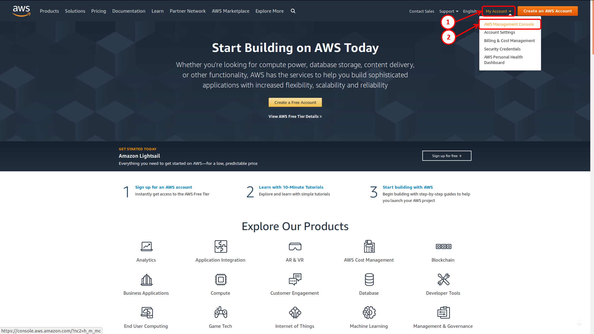

2. Use your AWS Credentials:
    1. Enter your `e-mail address` or your `AWS Account`
    2. Click on `Next`.

    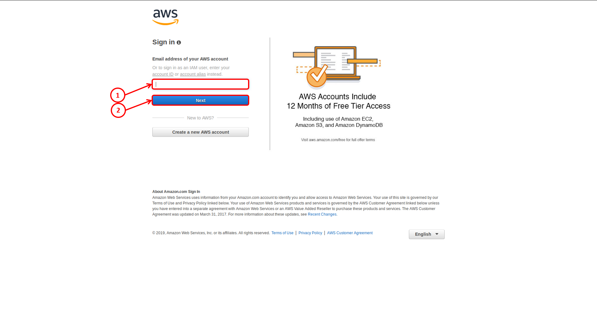

3. Contuinue with your AWS Credentials:
    1. Enter your `password`.
    2. Click on `Next`.

    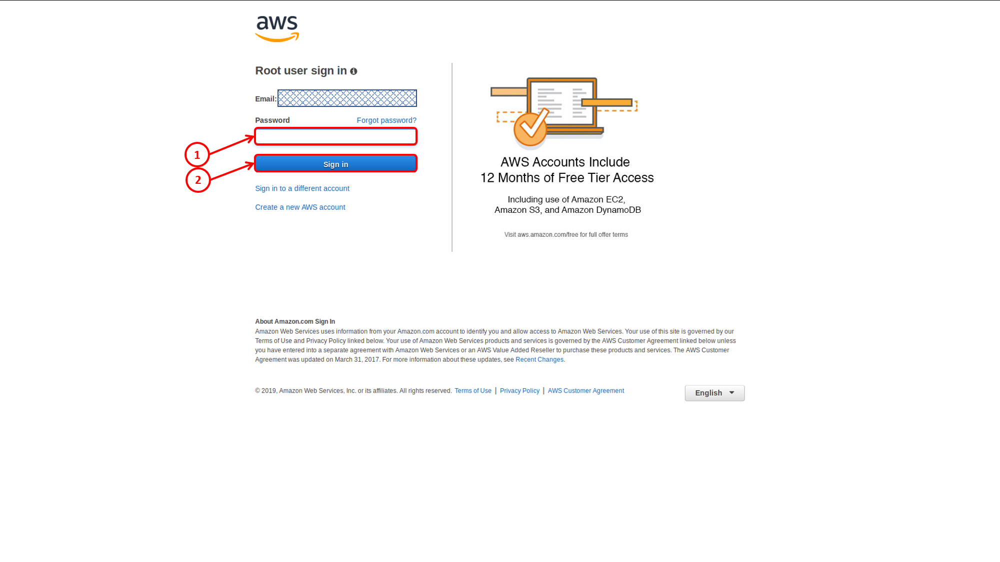

4. Locate the `Security, Identity, & Compliance` section:
    1. Click on `IAM`.

    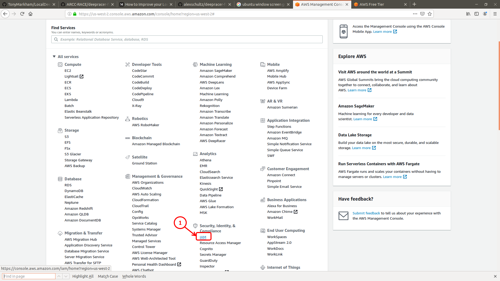

5. In the `IAM Resources` section:
    1. Click on `Users:`.

    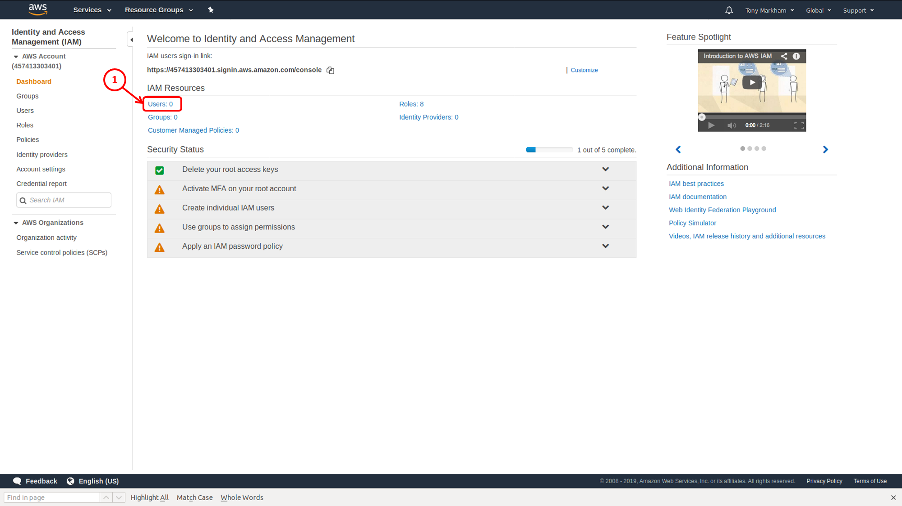

6. Click on the `Add user` button

    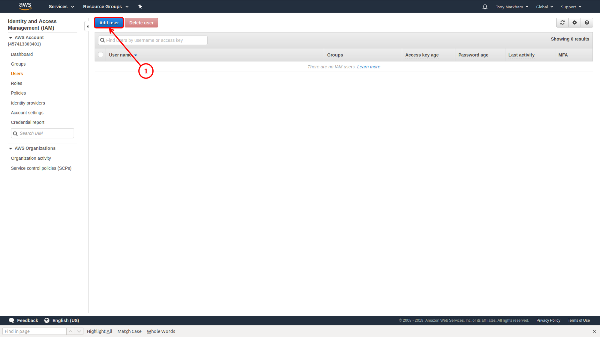

7. On the 1st `Add user` form:
    1. Enter a `User Name` in the `Set user details` area.
    2. In the `Select AWS Access` area, add a check beside `Programmatic access`.
    3. Click on the `Next: Permissions` button.

    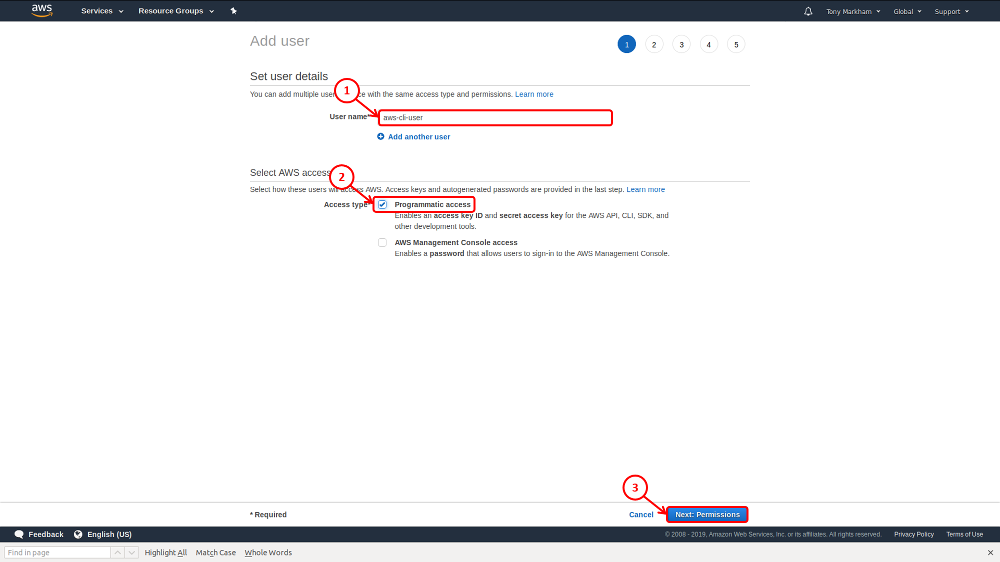

8. On the 2nd `Add user` form:
    1. Click on the `Attch existing policies directly` button.

    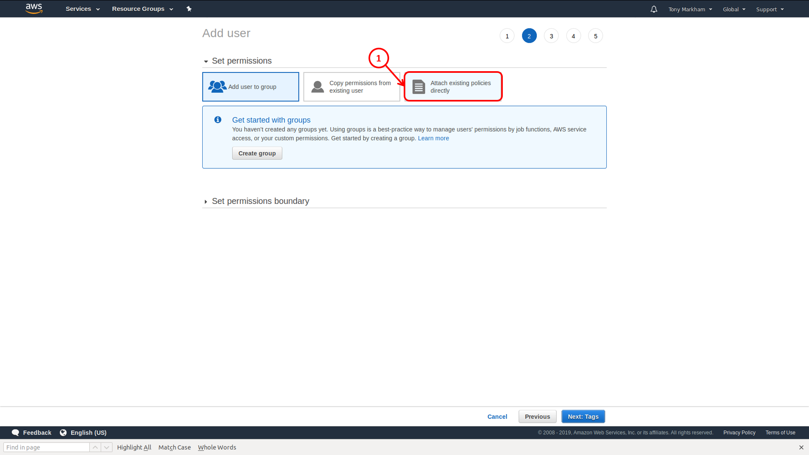

9. On the 3rd `Add user` form:
    1. Add a check beside `Administrator Access`.
    2. Click on the `Next: Tags` button.

    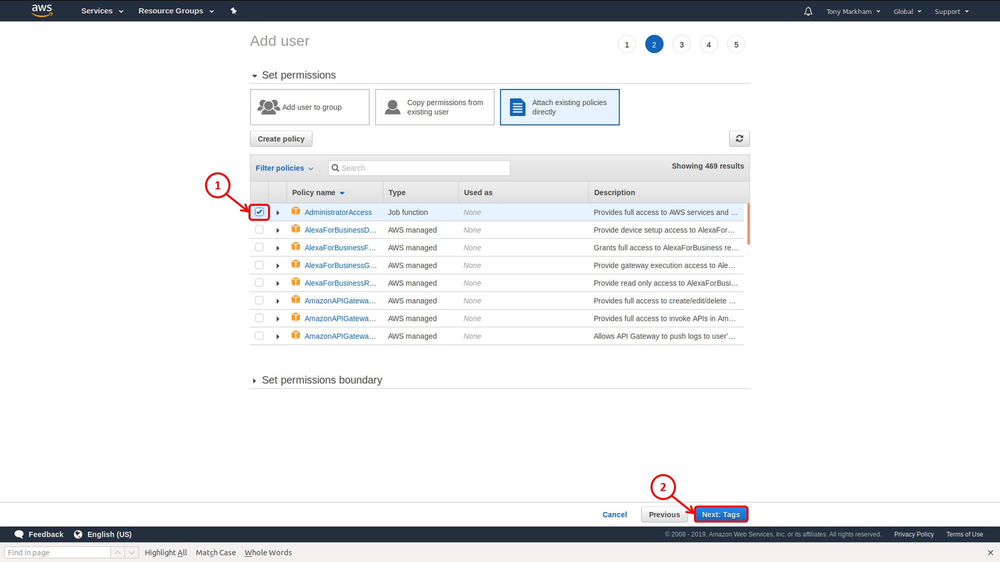

10. On the 4rd `Add user` form:
    2. Click on the `Next: Review` button.

    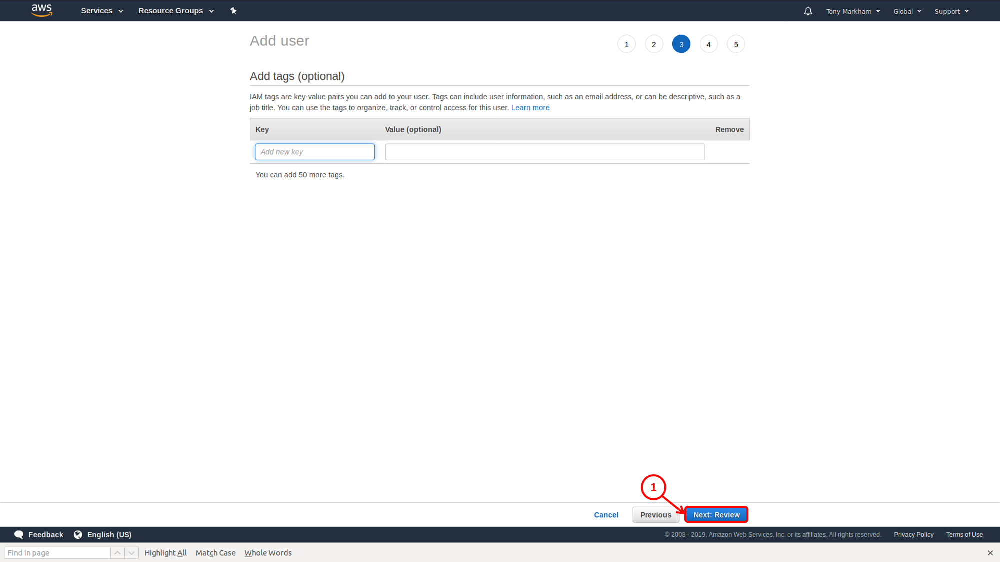

11. IMPORTANT: Keep the 5th `Add user` page open in order to reference the temporary information:
    1. The `Access Key ID` will be used when you run `aws configure`.
    2. The `Security access key` will be used when you run `aws configure`.

    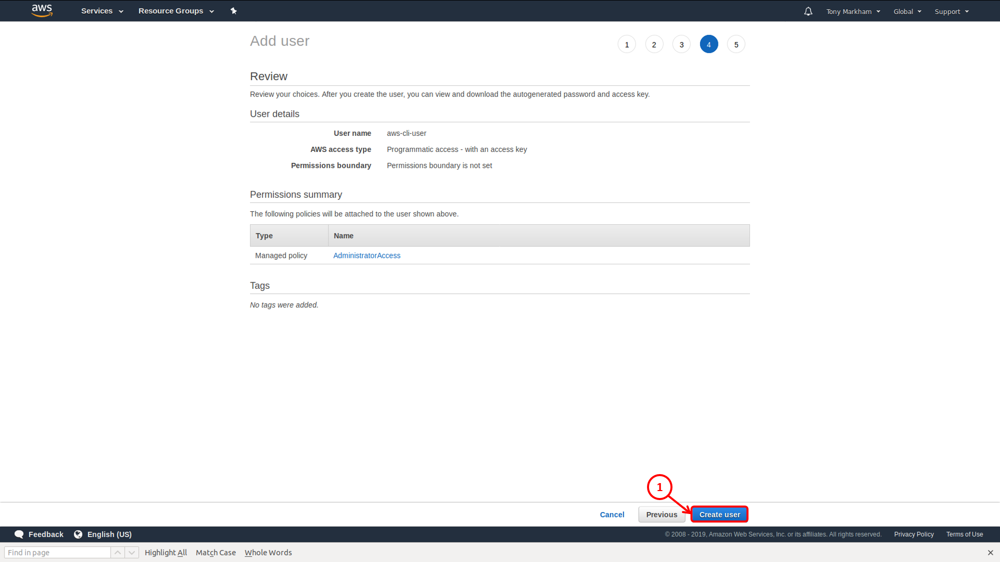

12. Configure your aws.cli:

    ```terminal
    aws configure
    AWS Access Key ID [None]: {from Step 11 > 1}
    AWS Secret Access Key [None]: {from Step 11 > 2}
    Default region name [None]: us-east-1
    Default output format [None]: table
    ```

[Back to Top](#Deep-Racer)

## **6. Install Docker**

1. Make sure your Ubuntu is clean of Docker components:

    ```terminal
    sudo apt-get remove docker docker-engine docker.io containerd runc
    ```

2. Update your packages:

    ```terminal
    sudo apt-get update
    ```

3. Install some prerequisite packages:

    ```terminal
    sudo apt-get install \
        apt-transport-https \
        ca-certificates \
        curl \
        gnupg-agent \
        software-properties-common
    ```

4. Add the GPG key for the official Docker repository:

    ```terminal
    sudo curl -fsSL https://download.docker.com/linux/ubuntu/gpg | sudo apt-key add -
    ```

5. Add the figerrprint:

    ```terminal
    sudo apt-key fingerprint 0EBFCD88
    ```

6. Add the Docker Repository to your apt sources:

    ```terminal
    sudo add-apt-repository \
        "deb [arch=amd64] https://download.docker.com/linux/ubuntu \
        $(lsb_release -cs) \
        stable"
    ```

7. Update your packages again:

    ```terminal
    sudo apt-get update
    ```

8. Install Docker:

    ```terminal
    sudo apt-get install docker-ce docker-ce-cli containerd.io
    ```

9. Check that Docker is running:

    ```terminal
    sudo systemctl status docker
    ```

    The output should be similar to the following, showing that the service is active and running:

    ```terminal
    ● docker.service - Docker Application Container Engine
       Loaded: loaded (/lib/systemd/system/docker.service; enabled; vendor preset: enabled)
       Active: active (running) since Sat 2019-08-10 14:48:45 EDT; 47s ago
         Docs: https://docs.docker.com
     Main PID: 8315 (dockerd)
        Tasks: 16
       CGroup: /system.slice/docker.service
               └─8315 /usr/bin/dockerd -H fd:// --containerd=/run/containerd/containerd.sock

    Aug 10 14:48:45 ununtu-tony dockerd[8315]: time="2019-08-10T14:48:45.758698003-04:00" level=warning msg="Your kernel does not support cgroup rt runtime"
    Aug 10 14:48:45 ununtu-tony dockerd[8315]: time="2019-08-10T14:48:45.758705200-04:00" level=warning msg="Your kernel does not support cgroup blkio weight"
    Aug 10 14:48:45 ununtu-tony dockerd[8315]: time="2019-08-10T14:48:45.758712580-04:00" level=warning msg="Your kernel does not support cgroup blkio weight_device"
    Aug 10 14:48:45 ununtu-tony dockerd[8315]: time="2019-08-10T14:48:45.758845989-04:00" level=info msg="Loading containers: start."
    Aug 10 14:48:45 ununtu-tony dockerd[8315]: time="2019-08-10T14:48:45.827769825-04:00" level=info msg="Default bridge (docker0) is assigned with an IP address 172.17.0.0/16. Daemon option --bip can be used to set a preferred IP address"
    Aug 10 14:48:45 ununtu-tony dockerd[8315]: time="2019-08-10T14:48:45.861340291-04:00" level=info msg="Loading containers: done."
    Aug 10 14:48:45 ununtu-tony dockerd[8315]: time="2019-08-10T14:48:45.907651660-04:00" level=info msg="Docker daemon" commit=74b1e89 graphdriver(s)=overlay2 version=19.03.1
    Aug 10 14:48:45 ununtu-tony dockerd[8315]: time="2019-08-10T14:48:45.907736004-04:00" level=info msg="Daemon has completed initialization"
    Aug 10 14:48:45 ununtu-tony dockerd[8315]: time="2019-08-10T14:48:45.920939799-04:00" level=info msg="API listen on /var/run/docker.sock"
    Aug 10 14:48:45 ununtu-tony systemd[1]: Started Docker Application Container Engine.
    ```

10. Check Docker's version:

    ```terminal
    docker --version
    ```

    And you should see something like this:

    ```terminal
    Docker version 19.03.1, build 74b1e89
    ```

[Back to Top](#Deep-Racer)

## **7. Install Docker Compose**

1. Run this command to download the current stable release of Docker Compose:

    ```terminal
    sudo curl -L "https://github.com/docker/compose/releases/download/1.24.1/docker-compose-$(uname -s)-$(uname -m)" -o /usr/local/bin/docker-compose
    ```

2. Apply executable permissions to the binary:

    ```terminal
    sudo chmod +x /usr/local/bin/docker-compose
    ```

3. Test Docker-Compose:

    ```terminal
    docker-compose --version
    ```

    And you should see something like this:

    ```terminal
    docker-compose version 1.24.1, build 4667896b
    ```

[Back to Top](#Deep-Racer)

## **8. Install nvidia-docker**

1. Set the `distribution` variable:

    ```terminal
    distribution=$(. /etc/os-release;echo $ID$VERSION_ID)
    ```

2. Set the gpgkey:

    ```terminal
    sudo curl -s -L https://nvidia.github.io/nvidia-docker/gpgkey | sudo apt-key add -
    ```

3. Add nvidia-docker to your apt-get's distribution list:

    ```terminal
    curl -s -L https://nvidia.github.io/nvidia-docker/$distribution/nvidia-docker.list | sudo tee /etc/apt/sources.list.d/nvidia-docker.list
    ```

4. Update the apt-get repositories:

    ```terminal
    sudo apt-get update
    ```

5. Install the `nvidia-docker2`

    ```terminal
    sudo apt-get install nvidia-docker2
    ```

6. Restart Docker:

    ```terminal
    sudo systemctl restart docker
    ```

[Back to Top](#Deep-Racer)

## **9. Post Docker Install**

1. Create the docker group.

    ```terminal
    sudo groupadd docker
    ```

2. Add your user to the docker group.

    ```terminal
    sudo usermod -aG docker $USER
    ```

3. Activate the changes to groups:

    ```terminal
    sudo newgrp docker
    ```

4. Verify that you can run docker commands without sudo.

    ```terminal
    docker run hello-world
    ```

5. Configure Docker to start on boot

    ```terminal
    sudo systemctl enable docker
    ```

[Back to Top](#Deep-Racer)

## **10. Install VNC Viewer**

1. Change to your `Downloads` folder

    ```terminal
    cd ~/Downloads
    ```

2. Download VNC Viewer.

    ```terminal
    sudo wget https://www.realvnc.com/download/file/viewer.files/VNC-Viewer-6.19.715-Linux-x64.deb
    ```

3. Install the VNC Viewer

    ```terminal
    sudo dpkg -i VNC-Viewer-6.19.715-Linux-x64.deb
    ```

4. Correct any missing depencies:

    ```terminal
    sudo apt install -f
    ```

5. Start `vncviewer` for the first time:

    ```terminal
    cd ~ && vncviewer
    ```

    Satisfy any windows that pop up and then close the viewer.

[Back to Top](#Deep-Racer)

## **11. Install Visual Studio Code**

1. Import the Microsoft GPG key:

    ```terminal
    wget -q https://packages.microsoft.com/keys/microsoft.asc -O- | sudo apt-key add -
    ```

2. Enable the Visual Studio Code repository:

    ```terminal
    sudo add-apt-repository "deb [arch=amd64] https://packages.microsoft.com/repos/vscode stable main"
    ```

3. Update the apt-get repository:

    ```terminal
    sudo apt update
    ```

4. Install the latest version of Visual Studio Code:

    ```terminal
    sudo apt install code
    ```

[Back to Top](#Deep-Racer)

## **12. Clone the deepracer-for-dummies Repository**

1. Create a Directory for cloning git Repositories:

    ```terminal
    mkdir git && cd git
    ```

2. Clone the Repository:

    ```terminal
    sudo git clone https://github.com/ARCC-RACE/deepracer-for-dummies.git
    ```

3. Change to the deepracer-for-dummies directory:

    ```terminal
    cd deepracer-for-dummies
    ```

4. Initialize the repo:

    ```terminal
    ./init.sh
    ```

[Back to Top](#Deep-Racer)

## **13. Start the Docker sagemaker-local Container**

```terminal
docker network create sagemaker-local
```

## **14. Start the training with the defaults**

```terminal
cd ~/git/deepracer-for-dummies && sudo ./scripts/training/start.sh
```

[Back to Top](#Deep-Racer)
