# **DeepRacer-For-Dummies - Configure aws.cli**

1. Go to [https://aws.amazon.com/](https://aws.amazon.com/).

    1. Click on `My Account`.
    2. Select `AWS Management Console`.
    * 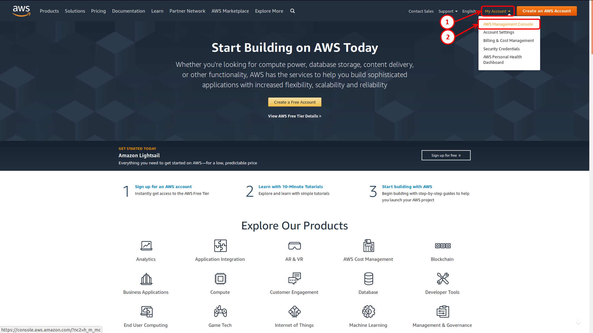

2. Use your AWS Credentials:
    1. Enter your `e-mail address` or your `AWS Account`
    2. Click on `Next`.
    * 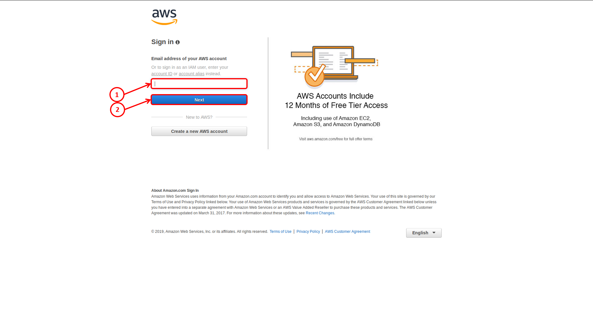

3. Contuinue with your AWS Credentials:
    1. Enter your `password`.
    2. Click on `Next`.
    * 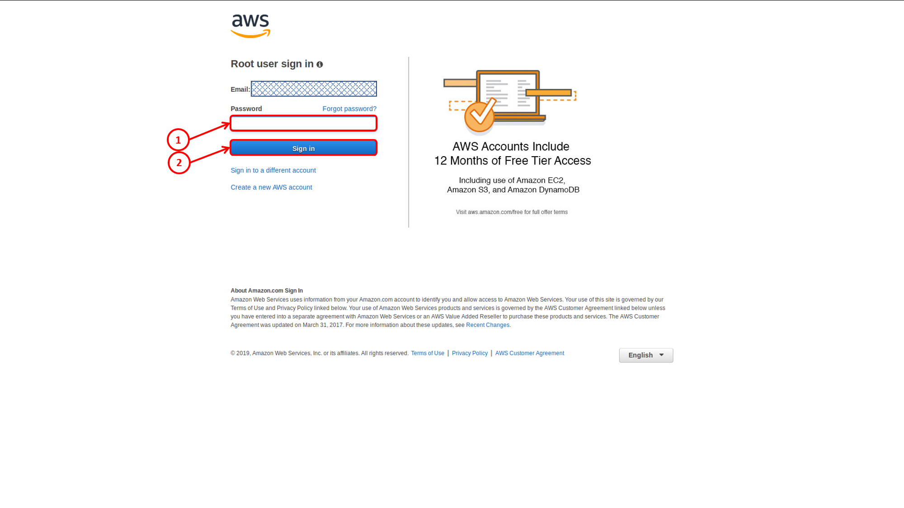

4. Locate the `Security, Identity, & Compliance` section:
    1. Click on `IAM`.
    * 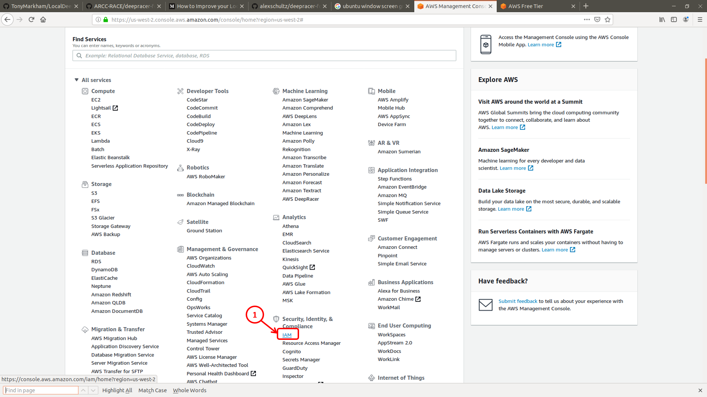

5. In the `IAM Resources` section:
    1. Click on `Users:`.
    * 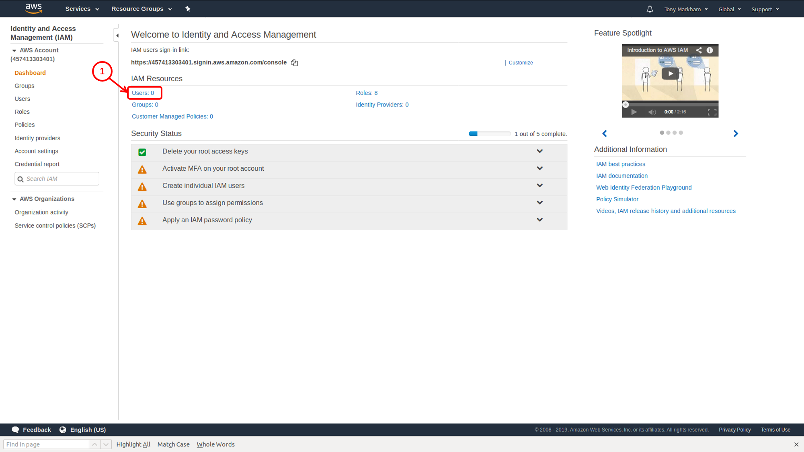

6. Click on the `Add user` button
    * 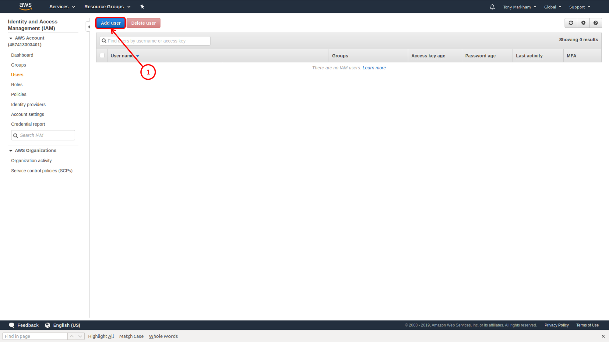

7. On the 1st `Add user` form:
    1. Enter a `User Name` in the `Set user details` area.
    2. In the `Select AWS Access` area, add a check beside `Programmatic access`.
    3. Click on the `Next: Permissions` button.
    * 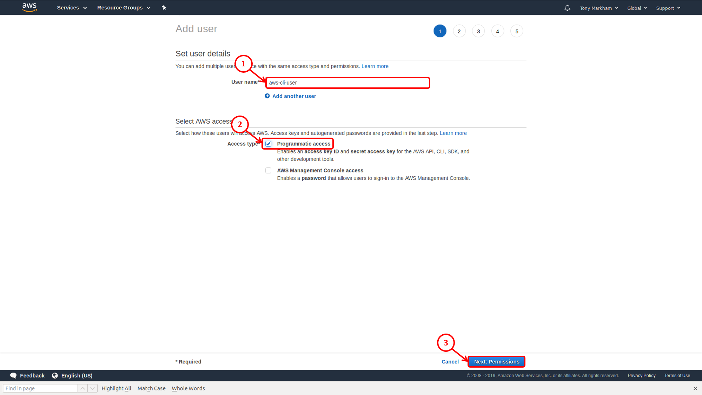

8. On the 2nd `Add user` form:
    1. Click on the `Attch existing policies directly` button.
    * 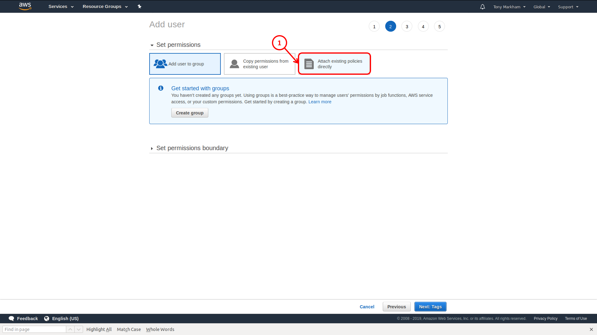

9. On the 3rd `Add user` form:
    1. Add a check beside `Administrator Access`.
    2. Click on the `Next: Tags` button.
    * 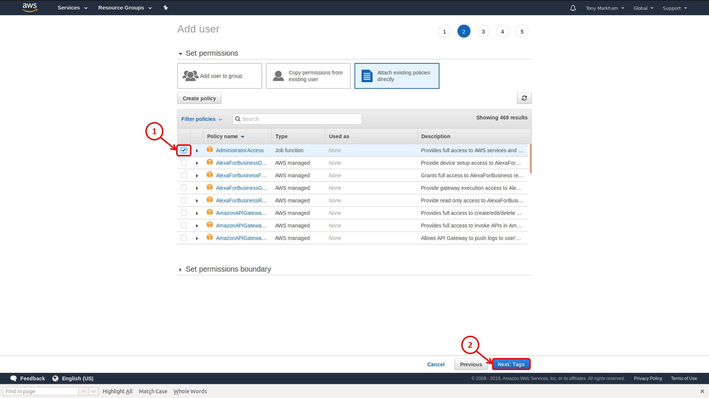

10. On the 4rd `Add user` form:
    1. Click on the `Next: Review` button.
    * 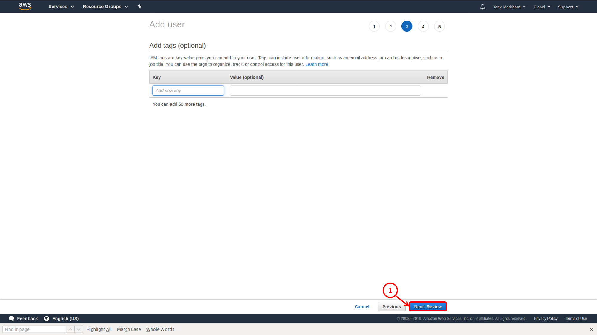

11. IMPORTANT: Keep the 5th `Add user` page open in order to reference the temporary information:
    1. The `Access Key ID` will be used when you run `aws configure`.
    2. The `Security access key` will be used when you run `aws configure`.
    * 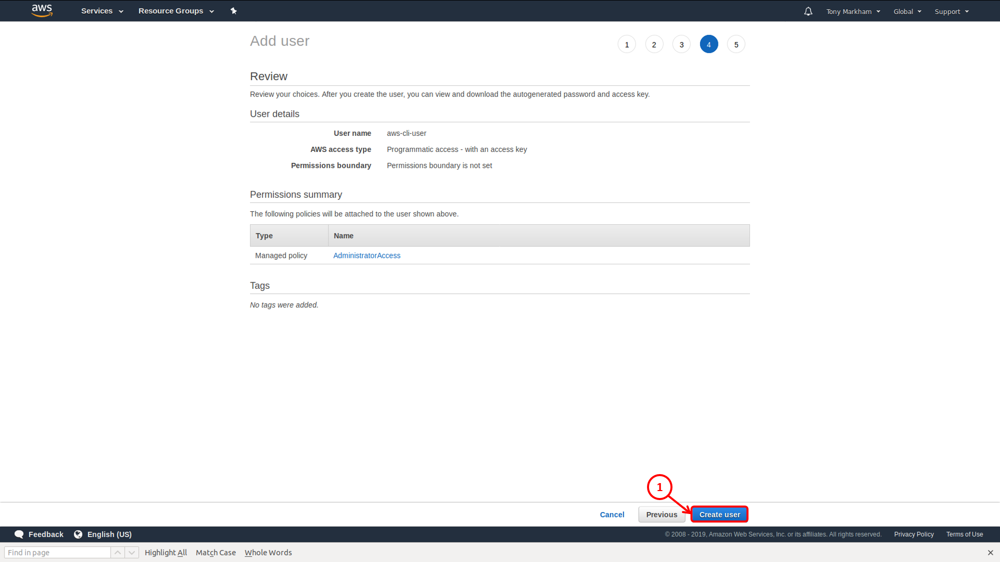

12. Configure your aws.cli:

    ```terminal
    aws configure
    ```

    Fill in the promts:

    ```terminal
    AWS Access Key ID [None]: {from Step 11 > 1}
    AWS Secret Access Key [None]: {from Step 11 > 2}
    Default region name [None]: us-east-1
    Default output format [None]: table
    ```

[Back to readme](../README.md)
